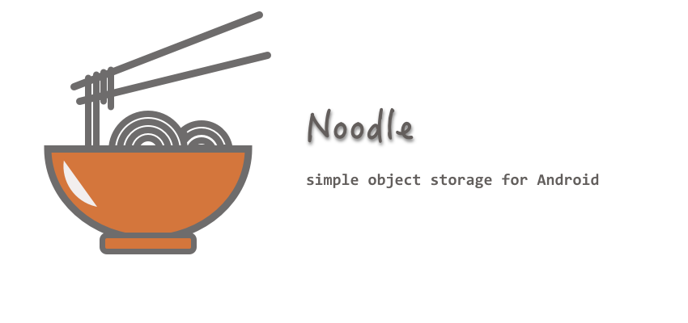

[](https://travis-ci.org/nolia/Noodle)   [](https://jitpack.io/#nolia/Noodle)
---


Noodle is a simple object storage for Android.

### Download

Get it from JitPack.


```
repositories {
    ...
    maven { url 'https://jitpack.io' }
}

dependencies {
    compile 'com.github.nolia:Noodle:v0.1'
}
```

## Usage

You can use Noodle both as a key-value storage and as collection persistence framework.

### Key-value storage
```java
Noodle noodle = new Noodle(context);
```

Put an object to storage.
```java
noodle.put("Android7", "Nougat").now();
```

Get stored value.
```java
T value = noodle.get("myObject", T.class).now();
```

Remove the data.
```java
boolean isRemoved = noodle.delete("toRemove").now();
```

### Collections
Using collections is also really simple: no schema, no relations, no consistency rules, no thread-contained objects.
Just create Noodle instance and register types you want to store:

```java
class Book {
  long id;
  String title;
  String author;

  public Book(String title, String author) {
    this.title = title;
    this.author = author;
  }
}

Noodle noodle = new Noodle(context)
  .registerType(Book.class, Description.of(Book.class)
    .withIdField("id")
    .build()
  );

```

Note: no annotations needed.

Collections allow you to *list*, *put*, *delete*, *get* (by id) and *filter* your objects.

```java
collection = noodle.collectionOf(Book.class);

Book book = new Book("I Robot", "Isaac Asimov");

// Get all.
List<Book> list = collection.all().now();

collection.put(book).now();
// Now, book object has updated id.

// Update:
book.title = "I, Robot";
collection.put(book).now();

// Delete:
collection.delete(book.id).now();

```

### Filter
```java
List<Book> search(final String query) {
  return collection.filter(new Collection.Predicate<Book>() {
    @Override
    public boolean test(final Book book) {
      return book.title.contains(query)
          || book.authorName.contains(query);
    }
  }).now();
}
```
Filtering is happening in memory, by pulling objects one by one and testing with provided predicate.

To store objects in collections, entities should have an id field, which has to have type of ```long``` or ```Long```.
Otherwise you have to declare your own *description* for entity class:
```java
class MyPreference {
  String id;
  String name;
}

// ...

noodle.registerType(MyPreference.class,
    Description.of(MyPreference.class)
        .withGetIdOperator(preference -> Long.parseLong(preference.id))
        .withSetIdOperator((preference, id) -> preference.id = Long.toString(id);)
        .build()
);
```

### Threading
Each operation on collections and key-value storage is synchronized on **Storage** level.
This means that can be only one read/write operation at a time.

All methods return `Result` object, which wraps the actual results,
that you can access either with synchronous `now()` method, or with callback and `get()` method.

```java
collection.filter(new Collection.Predicate<Book>() {
      @Override
      public boolean test(final Book book) {
        return book.title.contains(query);
      }
    })
    .executeOn(Executors.newSingleThreadExecutor())
    .withCallback(new Result.Callback<List<Book>>() {
      @Override
      public void onReady(final List<Book> books) {
        adapter.setBooks(books);
      }

      @Override
      public void onError(final Exception e) {
        Log.e(TAG, 'Error getting books:', e);
        Toast.makeText(context, "Could not get your books :(", Toast.LENGTH_SHORT).show();
      }
    })
    .get();
```

### Storage
Noodle stores all the data by converting it to byte arrays.
Default converter is Gson. But you can bring your own converter and store objects the way you want.


### Features:

- [X] Key-value storage
- [X] Simple collection storage
- [ ] Simple annotation processing for entities ids
- [ ] Rx support
- [ ] Encryption
- [ ] Id generation strategy
- [ ] Indexes (maybe)

### License
MIT license, see more [here](LICENSE.md).

